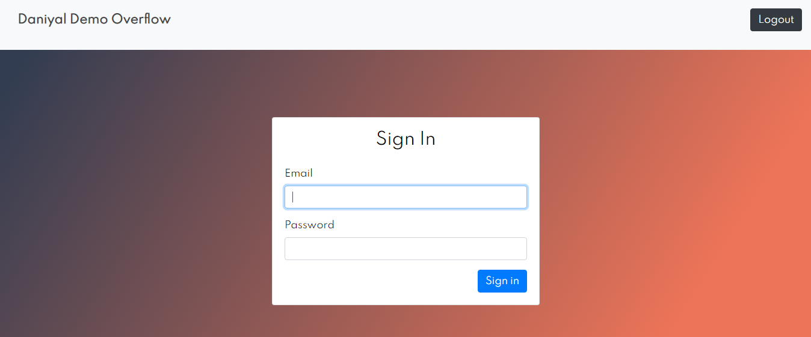
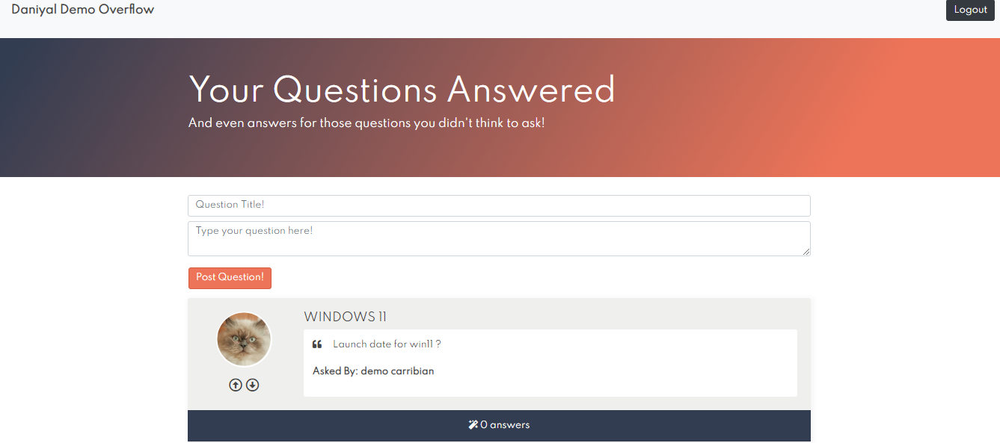
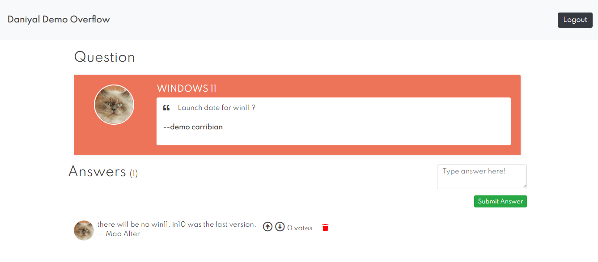

## Description
- My attempt at exploring the PHP Symfony5 web development framework to create Restful web app.  
- This is a demo PHP project for a Question & Answers blog.  
- Users can post questions and give an answer to posted question. 

More about symfony5  [here](https://symfony.com/5)  
[symfony5 Documentation](https://symfony.com/doc/current/index.html)

## How to run.

- To run this project, you need
- PHP 7.4 [download link](https://windows.php.net/download/)  
- symfony pre-requisits [(installation guide)](https://symfony.com/doc/current/setup.html)
- an empty MySql database named 'demodb'
- open cmd, goto project directory  
```
$ php bin/console make:migration         
$ php bin/console doctrine:migrations:migrate  
$ php bin/console doctrine:fixtures:load  
$ symfony serve  
```
Login details:  
user01 email: abc@gmail.com  
user01 password : abc

user02 email: cat@gmail.com  
user02 password : abc  
## Screenshots




